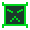
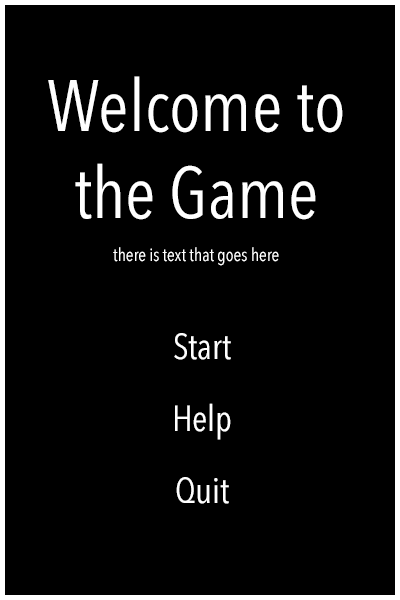
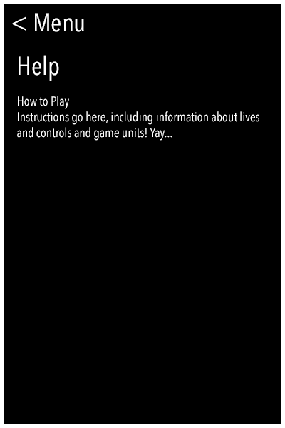
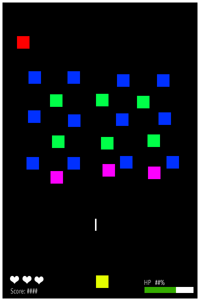
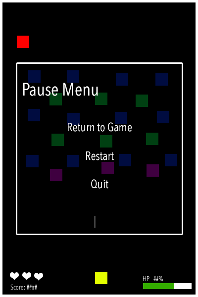
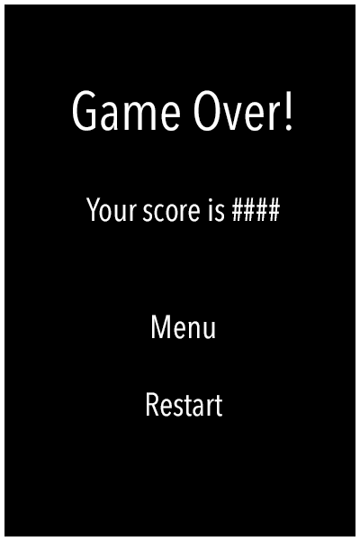

# Game Design Document
----

## Overview
Title: Starships (were meant to fly...)

A high-contrast themed shooting game based on Galaga and similar games. The player is a lone ship, , that must try to survive against waves of invading spaceships.

## Things
1. Red Ship - Mothership
	* Movement
		* Located above all other ships
		* Left and right across the screen 
		* **High** velocity
		* Will fly offscreen and fly into the abduction section in an attempt to abduct the player
	* Characteristics
		* HP: 4
		* **Special**: Abduction
			* Move downwards towards the player and "hover" there
			* Fires a tractor beam
			* If the player is hit by the beam, they will be "captured" and lose a life
			* Mothership then flies off the screen and can be considered "dead" for the level
		* Fires wide bullets **infrequently**
		* Only one mothership can spawn per level
	* Appearance
		* Red ship with flashing lights on top
		* Fires a rainbow colored beam
		* 
2. Blue Ship - Shooting Ship
	* Movement
		* Located in the general ship area
		* Moves only left and right
		* Normal velocity
	* Characteristics
		* HP: 2	 
		* Fires average-sized bullets once per cycle
		* Fires frequently
	* Appearance
		* Blue inverted triangle
		* 
		* 
3. Green Ship - Double Shooting Ship
	* Movement
		* Located in the general ship area
		* Moves in square patterns (cw and ccw randomly determined)
		* Normal velocity
	* Characteristics
		* HP: 6
		* Fires average-sized bullets twice per cycle (fires two in a row)
		* Fires frequently
	* Appearance
		* Green block with a angry face
		* 
4. Purple Ship - Kamikaze Ship
	* Movement
		* Located in the general ship area
		* Moves only left and right
		* Normal velocity
	* Characteristics
		* HP: 6
		* Does not fire bullet
		* When killed, will quickly move downwards until off screen
		* If player collides with the purple ship, they will lose a life
	* Appearance
		* Upside down purple jellyfish with black "X" for eyes
		* 
5. Projectile
	* Movement
		* Travels straight with predetermined speed
		* Only travels in the up-down direction
	* Characteristics
		* Exists until it collides with another object or goes off screen
	* Appearance
		* Player bullet
		* 
		* Blue ship bullet
		* 
		* Green ship bullet
		* 
		* Red ship bullet
		* 
6. Beam
	* Movement
		* Initial (root) point does not move
		* Beam grows until it reaches the bottom of the screen or a ship
	* Characteristics
		* Only fired by the red ship
		* Will stop growing on contact with the player
	* Appearance
	* Note: implemented in the game as a series of bullets that are fired frequently enough that they produce a long beam. Not technically a thing, but I felt that it was necessary to document it as a separate thing.

Notes:
* All ships excluding mothership will be given the same (relatively slow) speed, but initial velocity is randomly generated.
* Player's bullet starts with attack 1, then increases by 1 each level.
* Player starts with initial HP 10, which increases by 5 each level
* Initially, each ship bullet starts with attack 1 which inceases by 1 each level. Mothership is always double the base attack.
* On respawn, player has blinking invincibility for 5 blinks (ON OFF x5 + CONSTANT ON).

## How to play the game

* Levels
	* Levels are reached after a player kills all ships on screen. 
	* Levels are referred to as waves in the game
	* All waves are 17 ships each (not counting the mothership), the position and numbers of each ship are randomly generated
	* Player is healed between levels
* Increasing Difficulty
	* Timer speeds up each level, making everything move faster
	* Attacks of each ship increase each level
* Player Controls
	* Player can only move around and shoot, no extra abilities
	* Player can only move in a region below the ship spaw region, so they cannot be "above" the enemy
* Technical Gameplay
	* Keyboard Gameplay
	* Arrow keys to move and space to shoot
	* Esc to pause/unpause the game

## How the score changes
* Score is calculated by the ship killed
	* Blue - 100pt
	* Green - 150pt
	* Purple - 300pt
	* Red - 1000pt

## How to keep track of lives
* Each user starts with 3 lives
* When a user's HP drops to/below zero, they lose a life, and HP will be restored to 100%. 
* The game ends when the user runs out of lives

## Layout of UI
* Buttons
	* Start - Will start/restart the game
	* Pause - Will pause/unpause the game
	* Quit - Will exit the application
* Actions
	* Arrow keys to move in gameplay
	* Spacebar to shoot in gameplay
	* Esc to toggle pause
* HP Indicator
	* Shows the current HP%
* Hearts Bar
	* Shows the number of hearts in red
* Score indicator
	* Shows the current numerical score

## Pictures of what your interface would look like

### Start Screen

* Start screen will then lead to a screen that simply asks for a username, with a back button and a start button
* Username will be displayed at the end when the score is displayed

### Help Screen

### Sample Game Screen

* Currently using blocks to represent ships
* Hearts will be a different color 
* Color of play ship is yellow for now, but will be determined later

* The game is split into 5 sections
	* Top - Mothership section, only one mothership will spawn here at a time
	* Top-mid - Blue/green ship section, only blue and green ships will spawn here randomly
	* Bottom-mid - Purple ship section, only purple ships will spawn here
	* Top-bottom - Abduction section, the mothership will only appear here if it wants to abduct the player
	* Bottom - Player section, player cannot move out of this section. 

### Pause Menu

### Game End

### Credits
Graphics made in Adobe Photoshop CS6
Background image: http://universe-beauty.com/Space-art/Unsorted-space-art/stars-and-planets-photo-img87-895p.html

