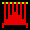
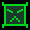

# Game Design Document
----

## Overview
Title: Starships (were meant to fly...)

A high-contrast themed shooting game based on Galaga and similar games. The player is a lone ship, , that must try to survive against waves (levels) of invading spaceships.

## Things
1. Red Ship - Mothership
	* Movement
		* Located above all other ships
		* Left and right across the screen 
		* **High** velocity
		* Will fly offscreen and fly into the abduction section in an attempt to abduct the player
	* Characteristics
		* HP: 4
		* **Special**: Abduction
			* Move downwards towards the player and "hover" there
			* Fires a tractor beam
			* If the player is hit by the beam, they will be "captured" and lose a life
			* Upon success, the mothership flies off screen and can be considered dead
			* Upon failure, the mothership flies back to the top and resumes normal flight pattern
		* Fires wide bullets **infrequently**
		* Only one mothership can be on screen at a time.
		* May drop heart on death
	* Apperance
		* Red ship with flashing lights on top
		* Fires a rainbow colored beam
		* 
2. Blue Ship - Shooting Ship
	* Movement
		* Located in the general ship area
		* Moves only left and right
		* Normal velocity
	* Characteristics
		* HP: 2	 
		* Fires average-sized bullets once per cycle
		* Fires frequently
	* Appearance
		* Blue inverted triangle
		* 
3. Green Ship - Double Shooting Ship
	* Movement
		* Located in the general ship area
		* Moves in square patterns (cw and ccw randomly determined)
		* Normal velocity
	* Characteristics
		* HP: 6
		* Fires average-sized bullets twice per cycle (fires two in a row)
		* Fires frequently
	* Appearance
		* Green block with a angry face
		* 
4. Purple Ship - Kamikaze Ship
	* Movement
		* Located in the general ship area
		* Moves only left and right
		* Normal velocity
	* Characteristics
		* HP: 6
		* Does not fire bullet
		* When killed, will quickly move downwards until off screen
		* If player collides with the purple ship, they will lose a life
	* Appearance
		* Upside down purple jellyfish with black "X" for eyes
		* 
5. Projectile
	* Movement
		* Travels straight with predetermined speed
		* Only travels in the up-down direction
	* Characteristics
		* Exists until it collides with another object or goes off screen
	* Appearance
		* Player bullet
			* White bullet
			* Travels relatively quickly
			* 2px wide, 10px long line
		* Blue/Green ship bullet
			* Blue/green bullets, depending on who fired them
			* Travels relatively quickly
			* 2px wide, 10px long line
		* Red ship bullet
			* Red-orange bullet
			* Travels relatively quickly
			* Wide
			* 20px wide, 10px long ellipse
		* Heart
			* Heart shaped, red-pink
			* Travels relatively slow
			* 20x20 pixels
6. Beam
	* Movement
		* Initial (root) point does not move
		* Beam grows until it reaches the bottom of the screen or a ship
		* Beam moves slower than a bullet but faster than a heart (approx halfway between)
	* Characteristics
		* Only fired by the red ship
		* Will stop growing on contact with the player
	* Appearance
		* Rainbow colored bars, 1px tall and 2px apart
		* Colors process in ROYGBIV order, then reverse, etc.

Notes:
* All ships excluding mothership will be given the same (relatively slow) speed, but initial velocity is randomly generated.
* Player's bullet starts with attack 1, then doubles with each level to a max of 8 (where every ship will die with one hit.)
* Player starts with initial HP 10, which increases by 5 each level
* Initially, each ship bullet starts with attack 1 (with mothership being attack = 2) and this will double each level.
* When a ship dies, it will flash twice (OFF ON OFF ON OFF) before disappearing from the game. During this time, all bullets will be absorbed by the ship.)
* On respawn, player has blinking invincibility for 5 blinks (ON OFF x5 + CONSTANT ON).

## How to play the game

* Levels
	* Levels are reached after a player kills all blue/green/purple ships on screen. 
	* Levels are referred to as waves in the game
	* Wave 1 starts with 10 b/g/p ships on screen, and this will increase by 5 each level until a maximum of 25 b/g/p ships are on the screen. 
*Increasing Difficulty
	* Timer will control the speed of the ships and bullets, which will make each level more difficult
	* More ships will be added each level
	* Enemy ships will also fire more frequently each level
* Player Controls
	* Player can only move around and shoot, no extra abilities
	* Player can only move in a region below the ship spaw region, so they cannot be "above" the enemy
* Technical Gameplay
	* Keyboard Gameplay
	* Arrow keys to move and space to shoot
	* Esc to open/close the pause menu
	* All menus are mouse-navigated only

## How the score changes
* Score is calculated by the ship killed
	* Blue - 100pt
	* Green - 150pt
	* Purple - 300pt
	* Red - 1000pt
* Picking up a heart gives 500pts
* Currently there are no ways for score to decrease

## How to keep track of lives
* Each user starts with 3 lives (that is, 2 hearts in the life counter)
* Red ships drop hearts upon death about 50% of the time, which can be picked up for a life
* Each user can have a maximum of 4 extra lives (lives after that will fully heal the user)
* When a user's HP drops to/below zero, they lose a life, and HP will be restored to 100%. 
* The game ends when the user runs out of lives.

Note: When the user has 1 heart, that means if they lose that heart, they will have 0 hearts remaining. They can play with 0 hearts, but the game ends after they run out of HP having no hearts. (Look at it like they are using their last life, with zero backup lives remaining.) 

## Layout of UI
* Menus
	* Start Menu
		* Start - Start game
		* Help - Go to help screen
		* Quit - Quit the game
	* Pause Menu
		* Return to Game - Return to currently paused game
		* Restart - Restart game
		* Quit - Exit to menu
	* End Menu
		* Menu - Exit to menu
		* Restart - Restart game
	* Back button on help screen to return to main menu
* Actions
	* Arrow keys to move in gameplay
	* Spacebar to shoot in gameplay
	* Esc to toggle the pause menu in gameplay
* HP Bar
	* Displays the current HP ratio using a green on white bar
	* Shows the current HP%
* Hearts Bar
	* Shows the number of hearts in red
	* Shows the outline for empty heart slots
* Score indicator
	* Shows the current numerical score

## Pictures of what your interface would look like

### Start Screen

* Start screen will then lead to a screen that simply asks for a username, with a back button and a start button
* Username will be displayed at the end when the score is displayed

### Help Screen


### Sample Game Screen

* Currently using blocks to represent ships
* Hearts will be a different color 
* Color of play ship is yellow for now, but will be determined later

* The game is split into 5 sections
	* Top - Mothership section, only one mothership will spawn here at a time
	* Top-mid - Blue/green ship section, only blue and green ships will spawn here randomly
	* Bottom-mid - Purple ship section, only purple ships will spawn here
	* Top-bottom - Abduction section, the mothership will only appear here if it wants to abduct the player
	* Bottom - Player section, player cannot move out of this section. 

### Pause Menu


### Game End

* Will actually read:

```
Game Over!
Good job [user name], your score was #######!
[encouraging or discouraging message generated based on the score]
```

## CREATE THIS ISSUEEEEEE

```
Title: Milestone 5A Submission
Label: PA5
Milestone: 5A
Assigned to:
Lecture MW 12pm @sprarage
Lecture MW 3:30pm @nakulj
Lecture TTh 12:30pm @Michael-Borke
Write (issue body): you state:
Your milestone 5A is ready for grading
The document file name
The SHA Hash of the commit to be graded.
```
